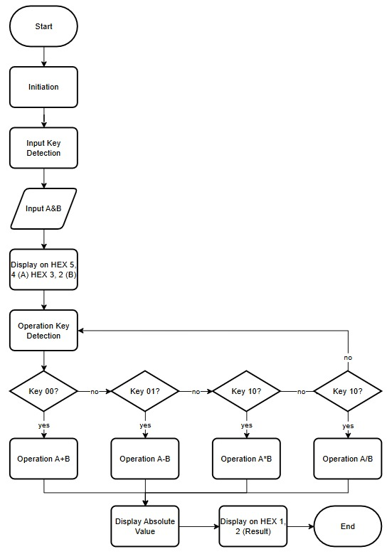
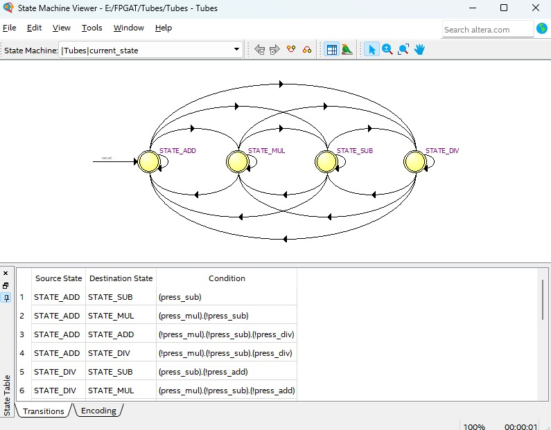

# Laporan Tugas Besar  
### Kuliah Desain FPGA dan SoC  

**Kelompok 6** :  
**Komang Sadhu Mahaputra - 1102223256** :  
**Muhammad Ferdiansyah - 1102223233** :  
**Muhammad Naufal Hafidz - 1102223250** :  
**Ashura Sindhu Santhana - 1102223224** :  

---

# Judul  
**PERANCANGAN DAN IMPLEMENTASI KALKULATOR ARITMETIKA FIXED-POINT 4-BIT BERBASIS FPGA**
---

# Deskripsi 
Kalkulator aritmetika fixed-point 4-bit berbasis FPGA merupakan sebuah sistem digital yang menerima dua buah bilangan bertanda dalam format fixed-point Q2.2, kemudian memprosesnya menggunakan operasi penjumlahan, pengurangan, perkalian, dan pembagian. Pemilihan operasi dilakukan melalui sinyal kontrol berupa switch atau push button, sedangkan hasil perhitungan ditampilkan dalam bentuk karakter heksadesimal pada 7-segment display. Sistem ini dirancang untuk memberikan pemahaman mengenai implementasi aritmetika fixed-point dan pemrosesan paralel pada FPGA.

Desain mencakup:  
- FSM   
- Testbench & simulasi ModelSim  
- Implementasi hardware pada DE1-SoC  

---

# Fungsi 
- Mengolah hasil perhitungan secara kombinasi sesuai operasi yang dipilih
- Menampilkan nilai operand dan hasil pada 7-segment dalam format BCD
- Menunjukkan implementasi pada FPGA

---

# Fitur dan Spesifikasi  

## **Fitur**
- Memproses oprasi aritmatika
- Input dari switch FPGA  
- Output berupa 7 Segment  

## **Spesifikasi**
- Input bit dari **SW & KEY**  
- Clock 50 MHz internal FPGA  
- Output aritmatika pada **7segment**   
- Implementasi Verilog HDL  
- Simulasi menggunakan ModelSim  
- FPGA: DE1-SoC (Cyclone V)  

---

# Cara Penggunaan  

### **Langkah-langkah**
1. Kompilasi desain di Quartus dan download file `.sof` ke FPGA.  
2. Berikan input bit menggunakan **SW0-7**.  
3. Tekan **KEY 0-3** untuk melakukan operasi aritmatika 
4. Output angka akan muncul pada **7 Segment 0-1** jika output minus (-) maka akan menampilkan **Er**.  

### **Flowchart**

# Blok Diagram  

# FSM (Mealy Machine)

FSM dirancang untuk memilih operasi aritmatika pada sistem kalkulator FPGA.

State (4 state Mealy)
- STATE_ADD – Mode penjumlahan aktif
- STATE_SUB – Mode pengurangan aktif
- STATE_MUL – Mode perkalian aktif
- STATE_DIV – Mode pembagian aktif 

Perilaku Transisi dan Output
- FSM berpindah state berdasarkan tombol operasi yang ditekan.
- Setiap state dapat berpindah langsung ke state lain, tidak harus berurutan.
- Output operasi aktif berubah segera saat tombol ditekan, sesuai karakteristik Mealy machine.

Output operasi dihasilkan saat transisi state yang dipicu oleh input tombol
(misal: dari STATE_ADD ke STATE_SUB ketika press_sub = 1).

---
# Hasil simulasi dan Analisis

Waveform menunjukkan bahwa perubahan input SW dan KEY langsung mempengaruhi keluaran 7-segment tanpa anomali sinyal. Nilai SW[3:0] dan SW[7:4] merepresentasikan operand, sedangkan KEY menentukan operasi yang diuji, yang terlihat dari perubahan pola biner pada HEX0–HEX5.

Pada operasi aritmatika normal, keluaran 7-segment menampilkan hasil yang benar dalam format BCD dan berubah segera setelah input diubah. Ketika terjadi hasil negatif atau pembagian dengan nol, HEX1 dan HEX0 menampilkan “Er”, menandakan bahwa logika pendeteksi error bekerja dengan benar. Setelah kondisi error berakhir, tampilan kembali normal. Secara keseluruhan, hasil simulasi menunjukkan bahwa modul kalkulator berfungsi stabil dan sesuai dengan rancangan.

# Lampiran (Kode Verilog)
Kode Verilog ada di sini: [Tubes.v](Tubes.v) & [seven_seg](seven_seg.v)
File test: [tb_Tubes.v](tb_Tubes.v) 

# Link Video Implementasi
https://github.com/Verlice-30/PERANCANGAN-DAN-IMPLEMENTASI-KALKULATOR-ARITMETIKA-FIXED-POINT-4-BIT-BERBASIS-FPGA/blob/c6bbea6e09c6db69a9422ed20766de3b3858cfd3/Video%20Implementasi%20FPGA.mp4
